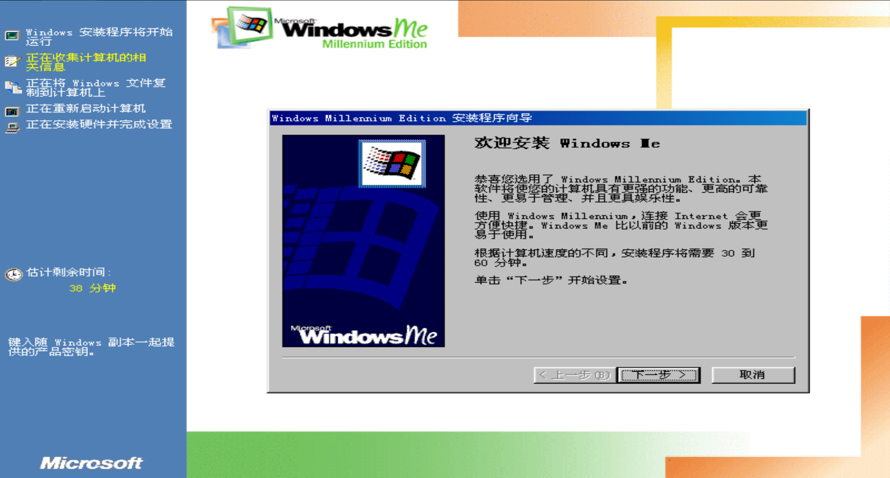

# Windows ME Chinese Upgrade Edition

**An AI-assisted Chinese localization and modification of Windows Millennium Edition (Windows ME) 112-Upgrade.**

This project provides **Simplified Chinese (简体中文)** and **Traditional Chinese (繁體中文)** upgrade editions of Windows ME.

The upgrade edition is based on **Windows ME 112-Upgrade (English)**, while the Chinese-language files are sourced from the corresponding **Chinese OEM release of Windows ME**.

The project uses AI-assisted modification and localization to adapt the Windows ME upgrade release for Chinese-language users while preserving the original Windows ME upgrade experience as much as possible.

## About

**Windows ME Chinese Upgrade Edition** is a modified version based on:

> **Windows ME 112-Upgrade (English)**

The Chinese-language files are derived from the corresponding **Chinese OEM edition of Windows ME**.

The editions were created through a combination of manual modification and AI-assisted work.

### Language Editions

| Language | Status |
|---|---|
| 🇨🇳 Simplified Chinese (简体中文) | **Released** |
| 🇹🇼 Traditional Chinese (繁體中文) | **Unreleased** |
| 🇺🇸 English | Original upgrade base |

The **Simplified Chinese edition has been officially released** as part of this project.

The **Traditional Chinese edition has not yet been released or publicly announced**.

## Screenshot

Below is a screenshot of the **Simplified Chinese Windows ME installation process**:

## What Is Windows ME 112-Upgrade?

Windows Millennium Edition (Windows ME) is a consumer operating system released by Microsoft in **2000**, succeeding Windows 98 and preceding Windows XP.

The **112-Upgrade** release used as the upgrade base for this project is an English Windows ME upgrade release.

This project modifies that release to provide Chinese-language upgrade editions.

## Chinese Language Files

The Chinese-language components used by this project are sourced from the corresponding **Chinese OEM release of Windows ME**.

This means that the Chinese edition is not simply a translation of the English Windows ME 112-Upgrade release. Chinese-language system files and resources are incorporated from the Chinese OEM edition, with additional modifications made for compatibility with the 112-Upgrade release.

## System Requirements

### Upgrade Path

> ⚠️ **Upgrade is only supported from Windows 98.**

This edition is intended specifically as an **upgrade from Windows 98**.

Other versions of Windows are not supported as an upgrade source.

## Project Goals

- Provide a **Simplified Chinese Windows ME upgrade edition**
- Develop a **Traditional Chinese Windows ME upgrade edition**
- Use Chinese-language files from the corresponding Windows ME OEM edition
- Preserve the original Windows ME upgrade experience where possible
- Make Chinese-language Windows ME available to enthusiasts and historical computing communities
- Document the modification and localization process

## Important Notes

This project is **not an official Microsoft release**.

Windows ME, Windows ME 112-Upgrade, the Windows ME OEM editions, and related trademarks and copyrights belong to their respective owners.

This project is intended for **historical, archival, localization, compatibility, and enthusiast purposes**.

Please ensure that you have the appropriate rights or a legitimate copy of the original Windows ME media required for your use.

## Disclaimer

The Chinese editions are modified versions based on Windows ME 112-Upgrade (English) and Chinese OEM Windows ME files.

They may contain differences, bugs, translation issues, or compatibility problems that are not present in the original Windows ME releases.

Because this project uses AI-assisted modification and localization, some translations or system behaviors may require further review and correction.

## Project Status

### 🇨🇳 Simplified Chinese

**Released**

The Simplified Chinese edition is the currently published Chinese version of this project.

### 🇹🇼 Traditional Chinese

**Unreleased**

The Traditional Chinese edition is currently under development and has **not been publicly released**.

Information about its release will be provided separately when it is ready.

## License

This project does not provide source code and is not released under an open-source software license.

The files included in this repository are modified distribution files based on **Windows ME 112-Upgrade （Englis）and Chinese OEM Windows ME files.*